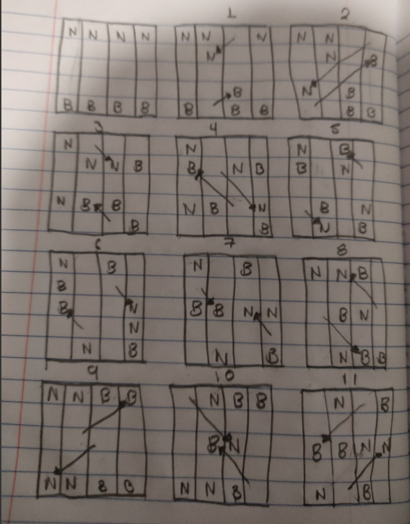
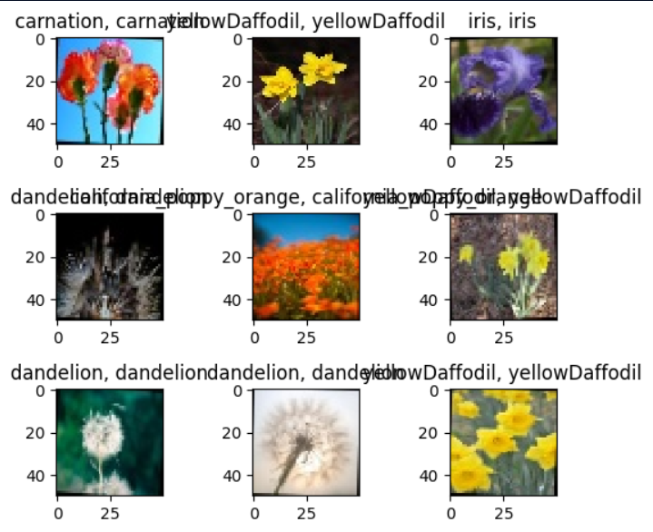

# Introducción a la Inteligencia Artificial. Actividad 1 - Práctica 1

## Redactar un ensayo mínimo 2000 palabras, del capitulo 1,2, 26, 27,apartado A del libro, inteligencia artificial un enfoque moderno.

### Introducción

En la actualidad los hombres nos hemos denominado Homo Sapiens (Hombre Sabio), esto debido a nuestra capacidad mentales. Aun así, durante miles de años hemos tratado de comprender como es que nosotros “pensamos”, es decir, como nosotros siendo un puñado de materia es capaz de predecir, percibir, entender las cosas a nuestro alrededor. En el ámbito de la Inteligencia Artificial (IA), no solo intenta comprender el como lo hacemos, si no, trata de generar o construir entidades inteligentes.

La IA como tal se comenzó a trabajar después de la Segunda Guerra Mundial y se acuño el termino en 1956, y al ser una de las ciencias más recientes, existen varias opciones o variaciones que aun no se investigan del todo, y esto también va de la mano de la gran cantidad de subcampos en los cuales se utiliza y estudia, yendo de lo general como es el aprendizaje y percepción, a términos más específicos como el juego del ajedrez, demostraciones matemáticas, poesía y diagnostico de enfermedades. Considerándolo asi un campo de estudio universal.

Pero ¿Qué es la IA o que define a una IA?

### Desarrollo

En el capitulo 1 del libro de “Inteligencia Artificial: un enfoque moderno” de Stuart Russell y Peter Norving, nos definen la IA de varias maneras extrayendo varios conceptos de libros diferentes, dividiéndolos en 2 secciones, la primera es la sección que se puede denominar como “el proceso de actuar de los humanos” y el segundo alude a un tema muy interesante, la **racionalidad**, este mismo se da a entender en el libro como un concepto ideal de la inteligencia. Igualmente se da un concepto de racionalidad: “Un sistema es racional si hace lo «correcto» , en función de su conocimiento”.

Ahora, regresando a los conceptos de IA y su división en dos secciones en el libro, estos se demuestran en 4 puntos:

- Sistemas que piensan como humanos: Este enfoque busca replicar la cognición humana, utilizando métodos como la introspección y experimentos psicológicos. La ciencia cognitiva, una disciplina interdisciplinaria, fusiona modelos computacionales de IA con técnicas experimentales de psicología para desarrollar teorías precisas sobre el funcionamiento de la mente humana.
- Sistemas que actúan como humanos: este trata de emular las actividades, que, por el momento, lo humanos realizan de mejor manera, para ello teniendo en cuenta que para realizar este tipo de actividades se debe tener un cierto grado de inteligencia, para ello Alan Turing propuse la Prueba de Turing.
- Sistemas que piensan racionalmente: se centra en la aplicación de la lógica y el razonamiento lógico para tomar decisiones. Un agente racional, según este enfoque, es aquel que busca el mejor resultado posible o, en situaciones de incertidumbre, el mejor resultado esperado.
- Sistemas que actúan racionalmente: este enfoque destaca la importancia de la acción deliberada para alcanzar el mejor resultado posible. Un agente racional, en este contexto, se define por su capacidad para tomar decisiones informadas y adaptarse a entornos cambiantes.

**Prueba de Turing**

Para medir la inteligencia de una IA, Alan Turing propuso en 1950 la Prueba de Turing el cual tiene el propósito de definir operacional y satisfactoriamente la inteligencia; en esta prueba Turing nos dice que una computadora debería de poseer las siguientes capacidades:

- Procesamiento de lenguaje natural
- Representación del conocimiento
- Razonamiento automático
- Aprendizaje automático

Esto nos dice que para que una computadora, según Turing, debe de poder comunicarse en un lenguaje natural, por lo general propuesto el inglés como lenguaje universal; debe de tener la capacidad de almacenar lo que conoce o siente para poder representarlo después; debe razonar para utilizar el conocimiento almacenado para poder responder preguntas y cuestionamientos y asi poder obtener nuevas conclusiones de temas propuestos; y por ultimo debe de aprender automáticamente para poder adaptarse a nuevas circunstancias y poder detectar y explotar nuevos patrones.

Igualmente, para que una computadora pueda superar la prueba, esta debe de estar dotada de visión computacional para poder percibir objetos; y robótica para poder manipular y mover los objetos.

**Fundamentos de la inteligencia artificial**

El libro aborda las contribuciones filosóficas de pensadores como Aristóteles, Ramón Lull y Thomas Hobbes. Comenzando con Aristóteles, el cual fue el primero en formular un conjunto preciso de leyes que gobernaban la parte racional de la inteligencia, desarrollando un sistema informal para razonar adecuadamente con silogismos (tipo de razonamiento deductivo), que en principio permitía extraer conclusiones, a partir de premisas iniciales.

Después surgió Ramon Lull, él, tuvo la idea de que el razonamiento útil se podría obtener por medios artificiales. Y por último tenemos a Thomas Hobbes, el cual propuso que el razonamiento tenia cierta similitud con la computación numérica, ya que decía que: “nosotros sumamos y restamos silenciosamente en nuestros pensamientos”.

Después de denotar que un conjunto de reglas puede describir la parte racional y formal de la mente, surgen algunos problemas y conceptos a tener en cuenta de estos conceptos filosóficos. Rene Descartes proporciona la primera discusión sobre la distinción entre la mente y la materia. Descartes sostiene y defiende el concepto de dualismo, el cual denomina que una parte de la mente esta al margen de la naturaleza y las leyes de la física, este problema por otro lado tiene la alternativa del materialismo, que considera que las operaciones del cerebro realizadas de acuerdo con las leyes de la física constituyen la mente.

Además, en el libro también se exploran conceptos como el principio de inducción y la doctrina del positivismo lógico, que busca caracterizar el conocimiento mediante teorías lógicas relacionadas con sentencias de observación.

Después de que los fundamentos filosóficos delimitaron las ideas de la IA, es necesario contar con formulaciones matemáticas en tres áreas importantes: lógica, computación y probabilidad, para poder pasar a la IA como una ciencia formal.

Se piensa que el primer algoritmo no trivial fue el algoritmo Euclidiano, el cual se destaca como un hito en el campo de las matemáticas aplicadas a la IA. Además, se discute el teorema de incompletitud de Gödel, que establece que, en cualquier lenguaje capaz de expresar propiedades de los números naturales, existen afirmaciones verdaderas que no se pueden decidir mediante ningún algoritmo.

Igualmente, se introduce el concepto de problemas intratables, donde el tiempo necesario para resolverlos crece exponencialmente con el tamaño de los casos. La teoría de la probabilidad, fundamental para la toma de decisiones, también se destaca como una herramienta matemática esencial en la IA.

Pasando a los fundamentos económicos, empezando con la teoría de decisión, que combina la teoría de la probabilidad con la teoría de la utilidad para proporcionar un marco completo y formal para la toma de decisiones realizadas bajo incertidumbre; y combinándolo con la teoría de juegos, el cual se basa en que cuando se tienen pequeñas economías, la situación se asemeja mas a un juego; esta teoría mostraba el hecho de que en algunos juegos, un agente racional debía actuar de manera aleatoria, o demostrar o aparentar ser aleatoria con respecto a los contrincantes en el juego.

Adicionalmente, se integran y se mencionan otros fundamentos, como la neurociencia, dada como estudio del sistema neurológico y el cerebro, se presenta como una disciplina fundamental para comprender la inteligencia artificial. La conexión entre la actividad cerebral y el comportamiento inteligente se convierte en un área de investigación crucial para la IA.

La inteligencia computacional, que se muestra como el artefacto para que la IA pueda convertirse en una realidad tangible.
La teoría de control moderna, especialmente la rama conocida como control óptimo estocástico, se presenta como una herramienta esencial en el diseño de sistemas que maximizan una función objetivo en el tiempo. La IA se redefine como el diseño de sistemas que se comportan de manera óptima.

Todos los fundamentos nos llevan al inicio de la IA como trabajo realizado, el cual se remonta a Warren McCulloch y Walter Pitts en 1943, quienes son reconocidos como los autores del primer trabajo de IA. Desde sus inicios, la IA abarcó la idea de duplicar facultades humanas como la creatividad, la auto-mejora y el uso del lenguaje. Se exploran diferentes enfoques, desde el sistema de símbolos físicos hasta la evolución automática y los sistemas basados en conocimiento.

Llegando a lo que se encuentra actualmente en donde los sistemas de IA han llegado a ser tan comunes en aplicaciones desarrolladas para la Web que el sufijo «bot» se ha introducido en el lenguaje común. Más aún, tecnologías de IA son la base de muchas herramientas para Internet, como por ejemplo motores de búsqueda, sistemas de recomendación, y los sistemas para la construcción de portales Web.

Pasando al capítulo 2, se profundiza el termino de **agente** y **agente racional**, determinando el concepto de agente como cualquier cosa capaz de percibir su medioambiente con la ayuda de sensores y actuar en ese medio utilizando actuadores. También dando las diferencias que existen entre un agente humano, ya que se compara en todo momento la IA con el humano, y un agente robot, “un agente humano tiene ojos, oídos y otros órganos sensoriales además de manos, piernas, boca y otras partes del cuerpo para actuar. Un agente robot recibe pulsaciones del teclado, archivos de información y paquetes vía red a modo de entradas sensoriales y actúa sobre el medio con mensajes en el monitor, escribiendo ficheros y enviando paquetes por la red”.

Ahora definiendo el concepto de agente racional, el cual el libro nos da la siguiente: “En cada posible secuencia de percepciones, un agente racional deberá emprender aquella acción que supuestamente maximice su medida de rendimiento, basándose en las evidencias aportadas por la secuencia de percepciones y en el conocimiento que el agente mantiene almacenado.”

Los conceptos de **IA débil** e **IA fuerte** se muestran en el capítulo 26, iniciando con la hipótesis de IA débil que nos dice que la inteligencia artificial débil sugiere que las máquinas pueden actuar con inteligencia o simularla.

La inteligencia artificial fuerte defiende que las máquinas realmente piensan, no solo simulan inteligencia. Se exploran argumentos como la consciencia, la fenomenología (experiencia directa) y la teoría del funcionalismo. Además, también se menciona la paradoja de la "Habitación China" para cuestionar la idea de que ejecutar un programa adecuado es suficiente para poseer verdadera inteligencia; junto con varios experimentos como el problema mente-cuerpo, experimento del cerebro en una cubeta y el experimento de la prótesis cerebral.

Aunado a esto, también se exploran ocho implicaciones éticas y riesgos asociados con la inteligencia artificial. Desde la pérdida de empleos hasta la pérdida de derechos privados, se plantean preocupaciones fundamentales. La posibilidad de que el éxito de la IA conduzca al fin de la raza humana destaca la necesidad de consideraciones éticas profundas en el desarrollo y aplicación de esta tecnología.

El capítulo 27 explora los elementos esenciales de los agentes inteligentes, dándonos una lista detalla de estos:

- Interacción con el entorno a través de sensores y actuadores
- Seguir la pista del estado del mundo: requiere tanto percepción como actualización de las representaciones internas
- Proyección, evaluación y selección de cursos futuros de acción: los requisitos básicos de representación del conocimiento son los mismos aquí que para seguir la pista del mundo
- La utilidad como expresión de preferencias: en principio, basar las decisiones en la maximización de la utilidad esperada es completamente general y evita muchos de los problemas de los enfoques basados puramente en objetivos, tales como objetivos conflictivos y consecución incierta
- Aprendizaje: puede formular el aprendizaje en un agente como aprendizaje inductivo (supervisado, sin supervisar o basado en el refuerzo) de las funciones que constituyen los diferentes componentes del agente.

También muestra la necesidad de arquitecturas híbridas que combinen reacciones repentinas con razonamiento basado en el conocimiento. La capacidad de controlar las deliberaciones y tomar decisiones en tiempo real se está convirtiendo en un aspecto importante de las arquitecturas de agentes inteligentes.

Y por último, al final del capítulo da una reflexión sobre la dirección que se esta tomando con la inteligencia artificial y su objetivo principal, nos muestra cuatro especificaciones de agentes que podemos construir con diferentes objetivos:

1. Racionalidad perfecta. Un agente perfectamente racional actúa en cualquier instante de tal manera que maximiza la utilidad esperada, dada la información que haya adquirido del entorno.
2. Racionalidad calculadora. Esta es la noción de la racionalidad que hemos utilizado implícitamente al diseñar agentes lógicos y teóricos para las decisiones.
3. Racionalidad limitada. la racionalidad limitada funciona en primer lugar satisfaciendo, es decir, deliberando sólo el tiempo necesario para elaborar una respuesta que sea lo suficientemente buena.
4. Optimalidad limitada. Un agente óptimo limitado se comporta todo lo bien que puede, dado sus recursos computacionales. Es decir, la utilidad esperada del programa agente para un agente óptimo limitado es por lo menos tan elevada como la utilidad esperada de cualquier otro programa agente que se ejecute en la misma máquina.

### Conclusiones

En resumen, la inteligencia artificial es un campo interdisciplinario complejo que incluye filosofía, matemáticas, neurociencia, ingeniería computacional, teoría de control, pasando por el ámbito económico y psicológico. La IA está en constante evolución, desde sus fundamentos hasta sus desafíos éticos, y promete cambiar fundamentalmente la forma en que la sociedad interactúa con la tecnología.

La comprensión y el uso ético de la inteligencia artificial serán fundamentales para garantizar un desarrollo rentable y sostenible hacia un futuro cada vez más automatizado.

La intersección de diferentes enfoques y disciplinas en este campo determina no sólo cómo creamos máquinas inteligentes, sino también cómo estas máquinas impactan en la sociedad y qué significa ser inteligente.

---

## Redactar un ensayo del Documental sobre IA mínimo 3000 palabras.

### Introducción

La inteligencia artificial (IA) se ha convertido en un protagonista destacado en el escenario tecnológico y cultural contemporáneo, generando una amplia gama de debates y expectativas. Desde sus fundamentos teóricos hasta sus aplicaciones prácticas, la IA ha demostrado su capacidad para cambiar la forma en que vivimos y trabajamos. En este ensayo, exploraremos los diversos aspectos de la inteligencia artificial, analizando sus definiciones, desafíos y contribuciones a diferentes sectores de la sociedad, a partir del documental “Inteligencia Artificial” de IBM.

### Desarrollo

**Definiendo la Inteligencia Artificial**

El documental inicia con definiciones de distintos expertos en la materia: el Dr. Rodney Brooks define a la inteligencia artificial como “un conjunto de practicas y piezas que las personas reúnen”; por otro lado, el Dr. Max Tegmark lo define como “la inteligencia que no es biológica”. Y el propio documental nos da la definición de inteligencia artificial: “a una maquina se le considera inteligente cuando muestra la capacidad de ver, escuchar, comprender y aprender sobre el mundo”.

A partir de ahora el documental nos lleva a distintas épocas del ser humano donde se ha utilizado inteligencia artificial para la resolución de problemas, presentándonos varios ejemplos del desarrollo de máquinas que utilizan IA.

**Comprensión del Lenguaje**

En este punto se nos explica que el lenguaje o la capacidad de comunicarse es uno de los mayores retos que presentan la creación de máquinas inteligentes, ya que nuestro lenguaje cuenta con diferentes matices, por lo que resultan complicados y difíciles de entender para las computadoras que están acostumbradas a reglas fijas determinadas por nosotros.

Uno de los mayores avances en la inteligencia artificial es cuando IBM desarrollo la maquina Watson, un sistema creado para jugar y competir contra los mejores jugadores de Jeopardy!.

Jeopardy! es un concurso de conocimiento sobre preguntas de numerosos temas, tales como historia, lenguas, literatura, cultura popular, bellas artes, ciencia, geografía y deportes. Uno de los tres concursantes elige uno de los paneles del tablero de juego, el cual, al ser descubierto, revela una pista en forma de respuesta, y es entonces cuando los concursantes entonces tienen que dar sus respuestas en forma de una pregunta.

Los desarrolladores de IBM tardaron años en desarrollar, perfeccionar y entrenar el sistema, junto con meses de practica de juegos en ambientes simulados; Watson fue desarrollado con algoritmos avanzados y tecnologías potentes de inteligencia artificial, como lo es el aprendizaje automático. Hasta que apareció Watson en televisión por primera vez.

En 2011 fue la primera aparición de Watson en televisión, la forma de funcionar el sistema es la siguiente: primero, intenta comprender la pregunta dividiéndola en diferentes partes de una oración, para después realizar una investigación en artículos, libros, revistas, etc. para obtener una posible respuesta. Luego recopila, analiza y compara todo el material obtenido para reducir las posibilidades, para finalmente ordenar las posibilidades filtradas por la confianza de respuesta correcta a la pregunta, todo esto en un tiempo de 2 segundos.

En la aparición de Watson, este enfrento a los mejores jugadores del concurso, terminando en una victoria aplastante por parte de la inteligencia artificial.

**Debatiendo con una maquina**

Después del éxito obtenido por la maquina Watson, el equipo de IBM quería llevar al siguiente nivel la inteligencia artificial y la comprensión del lenguaje con una maquina capaz de tomar decisiones a través del campo del debate, debate con humanos.

La complejidad de esta idea radicaba en conseguir que la computadora entendiera como hilar y conectar de manera coherente los diferentes conceptos que obtiene de los distintos artículos que puede consultar en segundos, para asi poder dar una respuesta al tema del debate.

Después de varios intentos y debates que se realizaron para hacer practicar a la computadora, Watson logro aumentar la aceptación de su idea casi un 50% de lo que recibida en un principio.

El sistema funciona a partir de los distintos artículos, documentos o libros a los que tiene acceso de los cuales obtiene la información del tema del debate para así poder proporcionar un argumento inicial, después de dar este argumento inicial, la computadora tiene que escuchar durante 4 minutos a su contrincante, escuchar el argumento el cual, por lo general, se da de manera rápida y, además, muchas veces tiene dilemas éticos y/o morales, y en el transcurso de la escucha, tiene que ir creando e hilando la información de los artículos a su disposición para dar un contraargumento de manera coherente.

**Inteligencia artificial en el camino**

Las aplicaciones de la inteligencia artificial en los últimos años se han estado expandiendo a diferentes ámbitos como la comprensión del lenguaje que utilizan los delfines, la inserción de un robot en el cuerpo policiaco en Dubai o el robot pizzero, el encargado de llevar pizzas a domicilio. Pero uno de los inventos que mas se han estudiado y se han querido implementar es el automóvil autónomo.

Este es uno de los mayores retos de implementación de inteligencia artificial y en demasía complejo. Es complejo por el hecho de que la inteligencia artificial aun no es totalmente perfecta, y en el documenta nos presentan el ejemplo del robot limpiador automático que utilizan muchas personas en casa, en muchas ocasiones este robot tiende a chocar con los muros múltiples veces y esto no representa un problema en el corto plazo de la tarea que tiene que realizar, limpiar la casa; pero al estar hablando de un coche con personas dentro, es necesario que este no cometa la acción de chocar múltiples veces por un fallo no previsto de los desarrolladores.

Por ello se plantea el cuestionamiento de que todavía no contamos con coches 100% autónomos, porque es difícil enseñarle lo que para nosotros es complejo, por ejemplo, tomar decisiones en ámbitos peligrosos como rutas lluviosas o rutas con poca luz, y otro problema se presentaría en el tráfico con otras personas. Además, es necesario implementar por completo la seguridad vial en el coche, para tomar la decisión más optima; todo esto en conjunto pone en cuestión la fiabilidad de estos autos autónomos.

La inteligencia artificial que se utiliza en los coches autónomos es a partir de la **percepción**, es decir, que es lo que veo, que cosas están alrededor de mí, para después descubrir cómo se mueven los objetos detectados o cómo se van a mover, esto se denomina **predicción**, para finalmente determinar a donde se dirige, por donde voy, esto es **planificación**.

Estos tres conceptos son necesarios para obtener los automóviles totalmente autónomos, sobre todo la predicción, ya que nosotros como seres humanos entendemos el tema del contexto, por ejemplo, cuando vamos manejando y vemos a unos niños jugando con una pelota o balón, sabemos inconscientemente que la pelota puede ir hacia la dirección donde estamos manejando; esto una inteligencia artificial no lo sabe por naturaleza, el solo detecta objetos cuadrados y circulares, sin tener la percepción de lo que podría llegar a suceder en un contexto asi. Por ello es necesario entrenar al coche autónomo con muchos contextos diferentes para que su predicción sea lo mas confiable posible y que la toma de decisiones sea rápida.

**Como aprenden las maquinas**

Aprendizaje automático: en este aprendizaje una computadora analiza los datos que obtiene, encuentra los patrones de esos datos y utilizando esos patrones encuentra la mejor ruta para un determinado objetivo.

Este concepto del aprendizaje automático apareció en los años 50 cuando una maquina aprendió a partir de múltiples juegos de damas chinas a ganarle a su propio creador. Hoy en día ese aprendizaje se ha exponenciado gracias a los avances tecnológicos en el campo del almacenamiento de datos, y al factor de la información; hoy, nosotros, somos parte del aprendizaje de muchos sistemas de inteligencia artificial, gracias a nuestras búsquedas en Google, videos de YouTube, tweets, publicaciones, y a nuestras propias conversaciones que son monitoreadas por nuestros dispositivos para proporcionarnos una retroalimentación de nuestros gustos.

Este concepto es el mas utilizado en la inteligencia artificial a la hora de hacer aprender a una maquina cualquier tema en específico, utilizado en el ejemplo anterior de las damas chinas, en el juego del ajedrez, etc.

**Trabajando con IA**

Históricamente, las maquinas han remplazado a los humanos en realizar cierto tipo de actividades, esto se dio por primera vez en la primera revolución industrial; esta es una de las cuestionas más fuertes contra la inteligencia artificial, la capacidad de desplazarnos y remplazarnos en nuestros trabajos.

En el documental nos mencionan algo que muy pocos mencionan al momento de dar este cuestionamiento: cuando las maquinas nos han remplazado de ciertos trabajos o empleos, estas mismas han abierto la posibilidad de nuevos empleos que no se podían realizar sin el apoyo de las maquinas.

Además, se da el punto de vista de que las personas no serán remplazadas por la inteligencia artificial, las personas serán remplazadas en los empleos por personas que trabajen con la inteligencia artificial.

Otro tema importante de ese punto de trabajando con la inteligencia artificial, son los robots “humanos”, los cuales se hacen con la idea de que se parezcan lo más posible a un humano, igualmente se da el punto de vista de que una maquina o robot nunca llegara a ser un humano realmente si no tiene **conciencia**, la cual es la responsable de darnos la empatía y moralidad, y dependiendo en donde se utilice esta inteligencia artificial, se vería bien o no el de proporcionarle algo lo más parecido a una conciencia.

**Aprendizaje de por vida**

Otro de los ámbitos o campos en el cual la inteligencia artificial ha incurrido últimamente es en la educación, desde nivel preescolar hasta nivel universitario.

En el preescolar se presento una aplicación para la ayuda del vocabulario de los niños, ya que cada uno aprende de una forma diferente y a su propio ritmo; esto igual apoya a los profesores que buscan que todos sus alumnos aprendan de manera eficaz.

Y, por otro lado, nos muestran la aplicación Tutor Watson, el cual es un apoyo a los estudiantes de universidad, en ella pueden preguntar acerca de un tema y el tutor les responde e igual les ayuda en el estudio por medio de preguntas, estas preguntas las puede generar de manera más especifica o replantearlas si es que el estudiante no las entiende. El objetivo por cumplir de Watson es ayudar a todos los estudiantes y proporcionar tutoría personalizada a cada uno, y en un futuro poder llegar a comprender o saber si el estudiante esta frustrado para así poder generar preguntas más acordes a como se sienta el estudiante.

**Fusión con las maquinas**

El tema de la fusión con las maquinas siempre ha fascinado al hombre, el cómo poder utilizar a nuestro favor las maquinas implementándolas en nuestro cuerpo.

En este punto, el documental nos explica lo que es la háptica, es decir, la ciencia de aplicar el tacto a nuestras interacciones con la tecnología, por ejemplo el vibrador del teléfono cuando recibimos una llamada en lugar de escuchar el timbre está utilizando la háptica.

De este concepto se nos presenta WearWorks, una empresa que hace uso de la háptica, en específico se nos muestra unos brazaletes que guían a los usuarios con discapacidad visual mediante vibraciones hápticas, si en el transcurso del caminar o correr de la persona se desvía fuera del camino, esta recibe vibraciones del lado que se está desviando para así recomponer el andar.

Estos brazaletes funcionan como un mapa gps, pero más preciso en las rutas que proporciona, siempre para llevar a la persona por la ruta menos transitada, e igualmente los datos recopilados por las personas que utilizan la banda se utilizan para seguir creciendo las rutas de guía.

La prueba que hicieron con la banda en el maratón de New York fue un avance impresionante, logrando que una persona recorra por su cuenta 21 de los 42 kilómetros totales, pero presento una serie de fallas al continuar con la carrera, el primero que se presento es la interferencia de la banda entre tantos puentes metálicos y las señales telefónicas de las miles de personas que asisten al evento; y el segundo fallo es al cambiar el clima, ya que cuando empezó a llover la banda dejo de mandar las señales a la persona y tuvo que terminar la carrera con apoyo de otras personas.

**Un sexto sentido sintético**

La utilización de la inteligencia artificial con máquinas de reconocimiento facial es bastante común hoy en día, de hecho, los encontramos en diferentes aparatos de nuestra cotidianidad, el más relevante es el teléfono celular cuando se desbloquea al reconocer nuestro rostro, lo hace a partir de una base de datos anterior, y a partir de una foto nuestra reconoce características particulares de nosotros.

Aquí se menciona que la privacidad de las personas en unos años será inexistente, gracias a que los gobiernos están desarrollando y trayendo mas y más aparatos biométricos para la recopilación de información a partir de las maquinas de reconocimiento; y esto lo llevamos a nuestra casa de manera voluntaria con la idea de más seguridad, más tecnología o más innovación y nos tendremos que acostumbrar rápidamente a que esto será una realidad.

Por ejemplo, en Israel están utilizando un sistema para detectar si una persona es un delincuente a partir de una imagen del rostro de la persona; también se desarrolló en Estados Unidos el “Gaydar”, el cual es un sistema que reconoce si una persona es homosexual, entrenado a partir de diferentes rostros, y la cual hace diferencias entre los gestos, movimientos y acciones de nuestra cara.

**En busca de un descubrimiento**

Ya se han mencionado varios contextos en donde la inteligencia artificial ha sido parte de la vida de los seres humanos, pero un tema importante que no se a tratado aun es la medicina. Watson for drugs Discovery, es un sistema que ayuda en el ámbito médico.

Lo hace leyendo millones de artículos científicos que salen cada año de distintas enfermedades, que para una persona es imposible de leer y comprender todos y cada uno de ellos en toda una vida, y asi con esos artículos poder conectar la enfermedad con distintos medicamentos que ayuden a erradicar o retrasar la enfermedad de la que se está estudiando.

En el documental se muestra el uso de Watson para encontrar fármacos para el Parkinson; Watson leyó y recopilo información de más de 28 millones de informes médicos en 15 minutos acerca del Parkinson, realizo conexiones con 3848 fármacos que podrían a llegar a ser útiles para la enfermedad, generando una lista ordenada.

Los expertos que monitorearon esta investigación de Watson comentan que muchos de los fármacos propuestos ya se tenían en cuenta para la enfermedad, pero, había muchos otros que ni siquiera habían tratado de verlo como una posibilidad y comenzaron a probar muchos de ellos en centros de laboratorio.

**Inteligencia General Artificial**

La inteligencia general es lo que los humanos poseemos, nosotros podemos realizar muchas cosas diferentes en muchos entornos diferentes. Actualmente no existe una computadora remotamente parecida a la inteligencia general, se menciona que muy probablemente ningún ser humano sea el que cree esta inteligencia general artificial, si no que, otra inteligencia artificial pueda ser la creadora de otras máquinas que puedan llegar a tener esa inteligencia general.

En el video nos mencionan un argumento al mayor temor de muchas personas sobre la inteligencia artificial, la rebelión de as maquinas como nos lo han presentado múltiples películas al respecto. Se dice que el temor no sería de una revolución de las maquinas contra el humano, si no más bien, que en algún punto no tengamos los mismos objetivos definidos las máquinas y nosotros. Nos dan el ejemplo de un hormiguero, si nosotros como humanos queremos realizar una carretera por el hormiguero, decidiremos por nuestro objetivo final quitar el hormiguero, pero eso no nos haría enemigos de las hormigas, simplemente no seguimos los mismos objetivos. Por ello es necesario adoptar a la inteligencia artificial con nuestros objetivos para no acabar como las hormigas.

### Conclusiones

En conclusión, la inteligencia artificial ha estado inmiscuida en muchos de nuestros entornos en los últimos 60 – 50 años, los llevamos viendo sin tener en cuenta que son como tal un sistema con inteligencia artificial.
Muchos de los puntos aquí planteados eran inexistentes de mi conocimiento, pero es bastante curioso e interesante varias de las aplicaciones que se han desarrollado con inteligencia artificial, comenzando con Watson y sus múltiples facetas en varios ámbitos, desde el ganar en un concurso de televisión y el tener un debate coherente con una persona profesional. Hasta poder ayudar a los médicos a completar la tarea de la investigación de que fármacos pueden ser beneficiosos para que tipo de enfermedades.

En mi opinión esta aplicación de inteligencia artificial, junto con Watson Tutor para la educación, son las mas relevantes de todas las que se mencionan en el documental, es impresionante como se puede recopilar millones de artículos, libros, consultar páginas, etc. en tan solo unos pocos minutos, lo que para un ser humano seria imposible realizar. El que pueda generar múltiples conexiones para obtener posibles medicamentos que puedan ayudar a las personas.

También con el tema de la privacidad y de la opinión de que las maquinas se pueden revelar en algún punto es un punto a tratar que muchos ya conocemos; la privacidad hoy en día es muy poca, mucho de ello es por nuestra propia culpa, con el tema de las redes sociales muchos son demasiado abiertos al publico para postear todo de su vida; pero por otro lado, se tiene conocimiento de que nuestros aparatos electrónicos, y sobre todo nuestros celulares escuchan en todo momento que es lo que decimos aun cuando la pantalla este apagada, esto lo hacen para recopilar información de nosotros, de nuestros gustos para que en la próxima entrada a Facebook o a alguna pagina de compras web nos recomiendo de lo que estabas hablando.

Ahora, que una maquina pueda revelarse en contra de los humanos, en el documental mencionan algo interesante, seguir los mismos objetivos, es necesario que las maquinas, robots, computadoras, se construyan a partir de la idea de un objetivo en común y se le entrene con ideas alrededor de ese mismo objetivo para que no exista mayor problema.

En general el documental es bastante entretenido, y es una buena introducción a lo que es la inteligencia artificial para alguien que no este metido mucho en ese mundo.

---

# Introducción a la Inteligencia Artificial: Tipos de Inteligencia.

## Escribir un ensayo mínimo de 4 cuartillas de la teoría de las inteligencias múltiples según Gardner

### Introducción

La teoría de las inteligencias múltiples de Gardner fue una propuesta hecha por el psicólogo Howard Gardner en la década de los 80s, esta teoría surgió como un contrapeso de la idea o paradigma de que existe una inteligencia única. Gardner sostiene que la inteligencia es un fenómeno mucho más diverso y complejo, y propone la existencia de múltiples formas de inteligencia, cada una con sus propias características y modos de expresión.

Durante el transcurso del siguiente ensayo se explicarán los distintos tipos de inteligencia que Gardner expuso.

### Desarrollo

Para entender el desarrollo de la teoría que Gardner propuso es necesario, primero, conocer como es que se entiende la inteligencia, que fue en lo que Gardner se interesó inicialmente para asi poner en duda el concepto.

La inteligencia, esta sumamente ligado a lo que se conoce como cociente intelectual, el cual está dado por pruebas de inteligencia y pruebas psicométricas; y a pesar de que este tipo de pruebas se han modificado, desarrollado y perfeccionando para poder generar medidas objetivas de la capacidad intelectual de las personas, estos no están libres de sesgos, ya que las estas están diseñadas para adaptarse a la sociedad actual, dando valor a diferentes capacidad que se consideran básicas para un ser humano, como lo son el hablar, el dominio de las matemáticas y el razonamiento lógico.

De esta idea Howard Gardner propuso y defendió la teoría de que la inteligencia no puede estar necesariamente entendida como una unidad, si no, puede entenderse como múltiples habilidades de procesamiento de la información, que funcionan de manera paralela e independiente unas de las otras. Esto lo podemos entender con el cociente intelectual, por ejemplo: si una persona obtiene un bajo CI, es muy probable que sea mas inteligente en otros ámbitos que no son entendidos ni atendidos por las pruebas que te dan ese CI.

Gardner identifica ocho inteligencias diferentes, cada una representando una forma única de habilidad cognitiva. Estas inteligencias incluyen la lingüística, lógico-matemática, espacial, musical, corporal-cinestésica, interpersonal, intrapersonal y naturalista. Cada una de estas dimensiones refleja la diversidad de habilidades y talentos que las personas pueden poseer.

**1. Lingüística:**
Esta inteligencia se relaciona con la habilidad para el lenguaje, tanto en la expresión escrita como hablada. Personas con una fuerte inteligencia lingüística tienden a sobresalir en la comunicación verbal y en la apreciación de la lengua. En este ámbito destacan una gran cantidad de profesiones como los son: la política, la escritura, la poesía, periodismo, actuación, etc.

**2. Lógico-Matemática:**
Aquí, la inteligencia se manifiesta en la capacidad para el razonamiento lógico, el análisis matemático y la resolución de problemas. Las personas con esta inteligencia pueden destacar en disciplinas como la ciencia y la ingeniería. Es en esta inteligencia en la que las pruebas de cociente intelectual se basan mas para sacar los resultados “objetivos”, junto con la inteligencia lingüística pero en menor medida.

**3. Espacial:**
La inteligencia espacial se refiere a la habilidad para visualizar y manipular objetos en el espacio. Las personas que destacan en este tipo de inteligencia suelen tener capacidades que les permiten idear imágenes mentales, dibujar y detectar detalles, además de un sentido personal por la estética. En esta inteligencia encontramos pintores, fotógrafos, diseñadores, publicistas, arquitectos, creativos, etc.

**4. Musical:**
Esta forma de inteligencia está vinculada a la apreciación y producción de la música. Gardner sugiere que la capacidad para entender patrones musicales y expresarse a través del sonido es una forma válida de inteligencia. Algunas zonas del cerebro ejecutan funciones vinculadas con la interpretación y composición de música y como cualquier otro tipo de inteligencia, puede entrenarse y perfeccionarse. Está de más mencionar que aquí destacan todas las personas que puedan tocar un instrumento o leer y componer piezas musicales.

**5. Corporal-cinestésica:**
La inteligencia corporal-cinestésica se manifiesta en la habilidad para controlar el cuerpo y manipular objetos de manera hábil. Atletas, bailarines y artesanos son los que por general muestran esta forma de inteligencia.

**6. Interpersonal:**
La inteligencia interpersonal se refiere a la capacidad para entender y relacionarse efectivamente con los demás. Es una inteligencia muy valiosa para las personas que trabajan con grupos numerosos. Su habilidad para detectar y entender las circunstancias y problemas de los demás resulta más sencillo si se posee (y se desarrolla) la inteligencia interpersonal. Profesores, psicólogos, terapeutas, abogados y pedagogos son perfiles que suelen desarrollar mas este tipo de inteligencia.

**7. Intrapersonal:**
Aquí, la inteligencia se enfoca en la comprensión de uno mismo, incluyendo la auto reflexión y la conciencia emocional. Aquellos con una inteligencia intrapersonal desarrollada pueden tener un conocimiento profundo de sus propias emociones y motivaciones. Según Gardner, esta inteligencia también permite ahondar en la introspección y entender las razones por las cuales uno es de la manera que es.

**8. Naturalista:**
La inteligencia naturalista implica una sensibilidad y aprecio por la naturaleza y el medio ambiente. Abarca la capacidad de distinguir, clasificar los detalles y los elementos del ambiente urbano, de los suburbios o el rural. Personas con esta inteligencia pueden tener una afinidad especial con los seres vivos y la ecología.
Esta inteligencia fue añadida posteriormente al estudio original sobre las Inteligencias Múltiples de Gardner, en el año 1995. Gardner consideró necesario incluir esta categoría por tratarse de una de las inteligencias esenciales para la supervivencia del ser humano (o cualquier otra especie) y que ha redundado en la evolución.

Es necesario destacar que durante el transcurso del tiempo, han surgido mas propuestas de inteligencia como, la culinaria, la sexual, la humorística o la digital, pero ninguna de ellas ha sido avaladas por Gardner, quedando hasta el día de hoy solo las ocho mencionadas.

Aunque la teoría de las inteligencias múltiples ha ganado aceptación y aplicación en la educación y a pesar de que revoluciono los ámbitos de la psicología, el laboral y el ámbito personal también ha enfrentado críticas. La más importante es el argumento de que la teoría carece de una base científica sólida y que las distintas inteligencias propuestas podrían ser simplemente habilidades o talentos en lugar de formas de inteligencia separadas. Además, algunos críticos dicen que la teoría de las inteligencias múltiples puede llevar a una sobrevaloración de las fortalezas individuales en detrimento de las habilidades académicas esenciales, al interpretarlas como estilos de aprendizaje.

### Conclusiones

La teoría de las inteligencias múltiples de Gardner revoluciono la forma de comprensión de la inteligencia al reconocer y celebrar la diversidad de habilidades humanas. Al considerar las distintas formas en que las personas pueden destacar, la teoría proporciona un marco valioso para la educación y el desarrollo personal.

Al aceptar la idea de que la inteligencia es multifacética y multidisciplinaria, nosotros como seres humanos podemos crear y especializarnos en entornos más efectivos al tipo de inteligencia y habilidad que poseamos, al existir el concepto de estas múltiples inteligencias es más fácil comprender de manera más completa la capacidad humana en general, y la capacidad personal que podemos llegar a alcanzar.

---

# Introducción a la Inteligencia Artificial: Introspección

## Se requiere resolver el siguiente problema analizando la forma en que usted mismo resuelve el problema. Redactar un ensayo de la solución.

Coloca ocho alfiles (cuatro blancos y cuatro negros) en un tablero de ajedrez, tal como se ve en la figura. El problema consiste en hacer que los alfiles negros intercambien posiciones con los blancos, ningún alfil debe atacar en ningún momento otro del colo opuest. Se deben alternar los movimientos, primero uno blanco, luego uno negro, luego uno blanco y así sucesivamente. ¿Cuál es el mínimo número de movimientos en que se puede conseguir?


### Introducción

El juego del ajedrez, con su intrincada red de estrategias y movimientos, presenta desafíos únicos que estimulan la mente y despiertan la creatividad de aquellos que se aventuran en sus cuadriculadas batallas. Uno de estos desafíos es el problema de los ocho alfiles.

### Desarrollo

En el problema de los ocho alfiles del ajedrez, obtuve 16 movimientos, esto sale debido a que realice el movimiento del blanco y negro en una misma instancia o mismo “tablero” por asi decirlo.

En este problema, para entender un poco el contexto del juego, hay que diferenciar los movimientos de los alfiles de las demás piezas del juego. Los alfiles en si se mueven diagonalmente hasta donde permite el tablero, este tipo de movimiento nos da juego a varias situaciones bastante peculiares en el tablero, pero hay que comenzar deshilando la serie de movimientos que se realizaron.

Primero que nada, hay que jugar mucho con el centro del tablero, específicamente con las seis casillas centrales disponibles. Con eso en mente, el primer movimiento es hacia el centro siempre, las dos piezas a mover, tanto blanco como negro, y en el caso propuesto las fichas que se mueven forman un tipo espejo.

En realidad, todos los movimientos los realice haciendo movimientos espejo, es decir, que si una blanca se mueve hacia algún lugar, la pieza negra se mueve en perspectiva de la misma forma pero en sentido contrario.

Después de varios movimientos, es necesario regresar, que en un principio, puede llegar a resultar un poco raro y que estas retrocediendo en lugar de avanzar, es absolutamente necesario hacerlo para que los movimientos de otras piezas ataquen a las que queremos mover en ese momento.

En cierto punto de los movimientos se aprecia que las piezas se acomodan de manera mitad blancas y mitad negras en ambos lados, ese es un punto intermedio de los movimientos, y como mencione anteriormente es necesario mover ciertas piezas que ya se encuentran en el lugar indicado o del lado correcto para poder seguir haciendo movimientos.

Al final se obtiene el resultado esperado, que es mover todas las piezas al otro lado del tablero de cada color.

### Conclusión

Este ejercicio de los alfiles nos muestra un problema de lógica y muchas veces de prueba y error, pero analizándolo un poco mejor y sobre todo viendo los movimientos que realizamos se observa mucho el movimiento espejo que realizan las piezas, justo en cada movimiento, y viéndolo de manera general a partir del movimiento 9 de ambos lados, se ve un poco de movimientos espejo en los siguientes movimientos de ambos.

Es bastante interesante el problema por el pensamiento y razonamiento que se tiene que realizar para poder mover las piezas de manera correcta, y al mismo tiempo visualizar los movimientos de las demás piezas existentes del color contrario.

A continuación, se muestran los movimientos y el resultado obtenido:




---

# Introducción a la Inteligencia Artificial: Introspección

## Se requiere resolver el siguiente problema analizado la forma es que usted mismo resuelve el problema redactar un ensayo de la solución.

Se trata de contar el numero de elementos (islas) contenidos en la siguiente imagen, se requiere lo siguiente:

- Hacer un programa que pueda contar el numero de elementos que son del mismo color.
- Utilizar método iterativo y recursivo.


---

### Resolución

```

def contar_islas_recursivo(matriz):

    filas = len(matriz)
    columnas = len(matriz[0])
    islas = 0

    def contar(i, j):
        if i >= filas or j >= columnas or matriz[i][j] == 0 or matriz[i][j] == 2:
            return
        matriz[i][j] = 2
        contar(i + 1, j)
        contar(i - 1, j)
        contar(i, j + 1)
        contar(i, j - 1)


    for i in range(filas):
        for j in range(columnas):
            if matriz[i][j] == 1:
                islas += 1
                contar(i, j)
            else:
                matriz[i][j] = 2

    return islas

matriz_original = [
[0, 0, 0, 0, 0, 0, 0, 0, 0, 0, 0, 0, 0, 0],
[0, 0, 0, 0, 0, 0, 0, 0, 0, 0, 0, 0, 0, 0],
[0, 1, 1, 0, 0, 0, 0, 0, 0, 0, 0, 0, 0, 0],
[0, 1, 1, 0, 0, 0, 0, 1, 1, 1, 1, 0, 0, 0],
[0, 1, 1, 0, 0, 0, 0, 0, 0, 0, 0, 0, 0, 0],
[0, 0, 0, 0, 0, 0, 0, 0, 0, 0, 0, 0, 0, 0],
[0, 0, 0, 0, 0, 0, 0, 0, 0, 0, 0, 0, 0, 0],
[0, 0, 0, 0, 0, 0, 0, 0, 0, 0, 0, 0, 0, 0],
[0, 0, 0, 0, 0, 0, 0, 0, 0, 0, 1, 0, 0, 0],
[0, 0, 0, 0, 0, 1, 1, 0, 0, 0, 1, 0, 0, 0],
[0, 0, 0, 0, 0, 1, 1, 0, 0, 0, 1, 0, 1, 0],
[0, 0, 0, 0, 0, 1, 1, 0, 0, 0, 1, 0, 1, 0],
[0, 0, 0, 0, 0, 1, 1, 0, 0, 0, 1, 0, 1, 0],
[0, 0, 0, 0, 0, 0, 0, 0, 0, 0, 0, 0, 1, 0],
[0, 0, 0, 0, 0, 0, 0, 0, 0, 0, 0, 0, 1, 0],
[0, 0, 0, 0, 0, 0, 0, 0, 0, 0, 0, 0, 1, 0],
[0, 0, 0, 0, 0, 0, 0, 0, 0, 0, 0, 0, 1, 0],
[0, 0, 1, 1, 1, 1, 0, 0, 0, 0, 0, 0, 1, 0],
[0, 0, 0, 0, 0, 0, 0, 0, 0, 0, 0, 0, 0, 0],
[0, 0, 0, 0, 0, 0, 0, 0, 0, 0, 0, 0, 0, 0],
[0, 0, 0, 0, 0, 0, 0, 0, 0, 0, 0, 0, 0, 0],
[0, 0, 0, 0, 0, 0, 0, 0, 0, 0, 0, 0, 0, 0]
]

resultado = contar_islas_recursivo(matriz_original)
print("Número de islas: " + str(resultado))
```

---

```
def contar_islas_iterativo(matriz):

    filas = len(matriz)
    columnas = len(matriz[0])
    islas = 0

    def contar(i, j):
        lista = [(i, j)]
        while lista:
            x, y = lista.pop()
            if  x < filas and y < columnas and matriz[x][y] == 1 and matriz[x][y] != 2:
                matriz[x][y] = 2
                lista.append((x + 1, y))
                lista.append((x - 1, y))
                lista.append((x, y + 1))
                lista.append((x, y - 1))

    for i in range(filas):
        for j in range(columnas):
            if matriz[i][j] == 1:
                islas += 1
                contar(i, j)
            else:
                matriz[i][j] = 2
    return islas

matriz_original = [
[0, 0, 0, 0, 0, 0, 0, 0, 0, 0, 0, 0, 0, 0],
[0, 0, 0, 0, 0, 0, 0, 0, 0, 0, 0, 0, 0, 0],
[0, 1, 1, 0, 0, 0, 0, 0, 0, 0, 0, 0, 0, 0],
[0, 1, 1, 0, 0, 0, 0, 1, 1, 1, 1, 0, 0, 0],
[0, 1, 1, 0, 0, 0, 0, 0, 0, 0, 0, 0, 0, 0],
[0, 0, 0, 0, 0, 0, 0, 0, 0, 0, 0, 0, 0, 0],
[0, 0, 0, 0, 0, 0, 0, 0, 0, 0, 0, 0, 0, 0],
[0, 0, 0, 0, 0, 0, 0, 0, 0, 0, 0, 0, 0, 0],
[0, 0, 0, 0, 0, 0, 0, 0, 0, 0, 1, 0, 0, 0],
[0, 0, 0, 0, 0, 1, 1, 0, 0, 0, 1, 0, 0, 0],
[0, 0, 0, 0, 0, 1, 1, 0, 0, 0, 1, 0, 1, 0],
[0, 0, 0, 0, 0, 1, 1, 0, 0, 0, 1, 0, 1, 0],
[0, 0, 0, 0, 0, 1, 1, 0, 0, 0, 1, 0, 1, 0],
[0, 0, 0, 0, 0, 0, 0, 0, 0, 0, 0, 0, 1, 0],
[0, 0, 0, 0, 0, 0, 0, 0, 0, 0, 0, 0, 1, 0],
[0, 0, 0, 0, 0, 0, 0, 0, 0, 0, 0, 0, 1, 0],
[0, 0, 0, 0, 0, 0, 0, 0, 0, 0, 0, 0, 1, 0],
[0, 0, 1, 1, 1, 1, 0, 0, 0, 0, 0, 0, 1, 0],
[0, 0, 0, 0, 0, 0, 0, 0, 0, 0, 0, 0, 0, 0],
[0, 0, 0, 0, 0, 0, 0, 0, 0, 0, 0, 0, 0, 0],
[0, 0, 0, 0, 0, 0, 0, 0, 0, 0, 0, 0, 0, 0],
[0, 0, 0, 0, 0, 0, 0, 0, 0, 0, 0, 0, 0, 0]
]

resultado = contar_islas_iterativo(matriz_original)
print("Número de islas: " + str(resultado))
```

### Ensayo

El código en si no tiene mucha complicación, la dificultad se encuentra en la lógica a utilizar para que el resultado sea el esperado. En este caso, y a manera personal, se sintió más sencillo el código recursivo, debido a que solamente es llamar a las funciones a los cuatro lados de la casilla actual; aunque dicho método puede ser un poco confuso si no se esta muy familiarizado con la recursividad, pero al haber hecho un ejercicio a mano del mismo problema, y en donde, realizamos el método recursivo, solo era programar la lógica de las decisiones.

Por otro lado, el método iterativo es un poco más difícil, ya por el simple hecho de que se necesita guardar las casillas donde se encuentre el valor 1 considerado como una isla, para asi poder contar las casillas anidadas a la primera encontrada y no contar erróneamente las islas totales.

En ambos casos se utiliza un contador junto con la matriz, e igualmente la lógica es un poco parecida, sobre todo en el recorrido de las casillas, ya que en los dos códigos se intercambia el valor de la casilla visitada a 2, asi ya no se cuentan las casillas que ya revisamos con anterioridad, y no se realiza la lógica de conteo de islas.

Ahora, explicando un poco los métodos, en el caso del recursivo, al encontrar una casilla con una isla y que no se halla visitado antes, se cuenta como una nueva isla y se hace el método siguiente: se marca la casilla visitada y se visita en ese momento los cuatro vecinos adyacentes a esa casilla, derecha, izquierda, abajo y arriba en ese orden, en busca de casillas con valor 1 que indicaría el seguimiento de la isla. Y asi se hará hasta que todos los valores adyacentes de las islas sean igual a 0 o 2.

Y por último, en el caso iterativo, se genera una lista (pila) en donde se van guardando las coordenadas de las casillas que contiene una isla, en un primer caso es la primer casilla, y se van añadiendo coordenadas de las cuatro casillas adyacentes de la primer casilla; es una pila por que utiliza el principio LIFO o FILO, el cual es el primero en entrar, ultimo en salir (First In, Last Out). Y a partir de ahí, se van agregando coordenadas si es que la casilla adyacente tiene valor 1.

Estos códigos son de mucha lógica en realidad, y es lo que en perspectiva va a costar muchísimo mas que ni en realizar el código, es mas un ejercicio mental que practico.

---

# Introducción a la Inteligencia Artificial: Introspección

## Se requiere resolver el siguiente problema analizado la forma es que usted mismo resuelve el problema, redactar un ensayo de la solución del problema.

Una vez que se resolvió el algoritmo de las islas en la siguiente imagen contar los elementos que tienen el color rojo.


---

### Resolución

```
import cv2 as cv

img = cv.imread('./image-2.png',1)
img2 = cv.cvtColor(img, cv.COLOR_BGR2RGB)
img3 = cv.cvtColor(img2, cv.COLOR_RGB2HSV)

umbralBajo = (0, 130, 130)
umbralAlto = (5, 255, 255)

umbralBajoB = (175, 130, 130)
umbralAltoB = (180, 255, 255)

mascara1 = cv.inRange(img3, umbralBajo, umbralAlto)
mascara2 = cv.inRange(img3, umbralBajoB, umbralAltoB)

mascara= mascara1+mascara2

resultado = cv.bitwise_and(img, img, mask=mascara)

def contar_rojos(matriz):

    filas = len(matriz)
    columnas = len(matriz[0])
    rojos = 0

    def contar(i, j):
        pixeles = 0
        lista = [(i, j)]
        while lista:
            x, y = lista.pop()
            if  x < filas and y < columnas and matriz[x][y] == 255 and matriz[x][y] != 2:
                matriz[x][y] = 2
                lista.append((x + 1, y))
                lista.append((x - 1, y))
                lista.append((x, y + 1))
                lista.append((x, y - 1))
                pixeles += 1

        return pixeles


    for i in range(filas):
        for j in range(columnas):
            if matriz[i][j] == 255:
                conteo = contar(i, j)
                if conteo > 150:
                    rojos += 1
            else:
                matriz[i][j] = 2

    return rojos

matriz_original = mascara
rojos = contar_rojos(matriz_original)
print("Número de rojos: " + str(rojos))

cv.putText(img, 'Numero de rojos: ' + str(rojos), (40, 50), cv.FONT_HERSHEY_SIMPLEX, 1.1, (0, 0, 0), 2, cv.LINE_AA)
cv.imshow('resultado', img)


cv.waitKey(0)
cv.destroyAllWindows()
```

### Ensayo

El proceso de este ejercicio es bastante similar al anterior, que de hecho tenemos que utilizar un metodo, ya sea recursivo como iterativo, para poder contar los objetos de color rojo, en este caso, se utilizo el método iterativo, ya que es un poco mas sencillo de utilizar en este caso, a mi opinion.

Se utilizo el codigo ya proporcionado por el profesor para la captura y procesamiento de la imagen, y, como se dijo anteriormente se utilizo el metodo iterativo para el conteo de los pixeles, en este caso blancos, de la imagen procesada en escala de grises, esto se identifica que cada pixel con valor 255 o blanco, es un pixel de color rojo.

El codigo iterativo se cambio solo un poco para que en lugar de contar las islas, contara los pixeles blancos, y asi poder identificar los objetos de color rojo y obtener el total.

El principal problema radico en que tomar como un objeto rojo, esto debido a que el procesamiento de la imagen es pixel por pixel, y puede surgir el caso de que en una esquina super escondido se encuentre un pixel rojo, por ello se agrego una condicion para que solo se contaran los objetos que tuvieran mas de 150 pixeles blancos, esto para evitar contar pixeles sueltos que no formaran parte de un objeto rojo.

El tamaño de los pixeles se puede modificar en la linea 45 del codigo, en donde se encuentra la condicion para contar los pixeles, en este caso se utilizo 150, pero se puede modificar a gusto y a conciencia de quien considere cuantos pixeles son suficientes para decir efectivamente lo que se esta viendo es un objeto y no solo pixeles sueltos.

---

# Introducción a la Inteligencia Artificial: El proceso de razonamiento según la lógica

## 1. Dado el siguiente problema hacer el planteamiento matemático y programar el siguiente problema

La historia que sigue es una versión adaptada de lo que –supuestamente—sucedió durante el siglo I. Sí, el siglo uno. Suena raro, ¿no? Más aún: esa historia dio origen a un problema clásico de la matemática/computación quesobrevivió el paso del tiempo. Se lo conoce con el nombre del “Problema de Josephus”, ya que se supone que fue Flavius Josephus, un historiador judíonacido en Jerusalén, quien describió la situación que vivieron él y 40 soldados que lo acompañaban.

En un momento determinado de la guerra judeo-romana, Josephus y su grupo cayeron en una emboscada y quedaron atrapados en una caverna rodeada de soldados enemigos. Después de debatir cómo proceder, optaron por suicidarse antes de ser capturados. Sin embargo, Josephus no estuvo de acuerdo con la propuesta y para que nadie tuviera que quitarse la vida,propuso el siguiente método:

“Sentémonos todos en un círculo. Alguno de nosotros empezará primero y matará a quien tenga sentado a la izquierda y así vamos a seguir hasta que –claramente— quedará nada más que uno solo de nosotros con vida. Ese será el único que tendrá que suicidarse”.


Allí están las cuarenta y un posiciones numeradas en forma creciente.Supongamos que empieza el que está sentado en la posición número 1. Ese soldado matará al 2. Luego, el 3 matará al 4, el 5 al 6. . . y así siguiendo. Como usted advierte, llegará un momento en el que habrán muerto todos los que están sentados en las posiciones que llevan un número par. Pero cuando muera el último de ellos, el número 40 (a manos del 39), el 41 estará vivo aún y ahora, el que tiene sentado a la izquierda es el número 1 quien había empezado con los asesinatos.

De acuerdo con las reglas, el 41 matará al , el 3 al 5, etc. Creo que ahora esta claro que van a morir todos hasta que quede solamente uno con vida.

Es aquí donde aparece una parte interesante de la historia de Josephus. En principio, habrían de morir todos los soldados que estaban con Josephusen la caverna, pero la diferencia es que quien quedara último tendría que suicidarse. . . Más aún: el sobreviviente tendría que quitarse la vida y no habría ningún otro integrante del grupo que estuviera vivo para verificar que lo hiciera.

Como usted se imagina, Josephus eligió un lugar particular del círculo yse sentó allí. El sabía que siguiendo las reglas escritas más arriba, él habría de quedar como único sobreviviente. Esperó que todos estuvieran muertos, y en lugar de suicidarse, salió de la caverna y se entregó al enemigo.

Pregunta: ¿en qué lugar se sentó Josephus?

El problema es muy conocido en el mundo de la matemática y los programadores, y es por eso que hay muchísima literatura escrita sobre el tema, pero no hace falta saber nada particular para poder pensarlo. La versión que figura más arriba es solo una de las posibles variantes (la más sencilla) y si yo estuviera junto a usted, le sugeriría que no empiece con el caso delos 41 soldados, sino que intente con números más pequeños (de soldados) de manera tal de ver si le es posible intuir o imaginar una estrategia paradeterminar al ganador o sobreviviente a medida que va incrementando el número de soldados.

De la misma forma, una vez que hayamos resuelto el problema para 41 soldados, sería interesante pensar en una estrategia que permita deducir cuál será la posición ganadora en el caso general, es decir, independizarse del número 41 y encontrar alguna estrategia o fórmula que permita deducir elnúmero que hay que elegir sin tener que recorrer todos los pasos intermedios.

---

### Resolución

```
def Josephus (n):
    soldados = [i for i in range(1, n+1)]

    i = 0
    while len(soldados) > 1:
        if i >= len(soldados):
            i = 0

        if i == len(soldados) -1:
            soldados.pop(0)
        else:
            soldados.pop(i+1)

        i += 1


    print("El soldado que se salva es el: ", soldados[0], "\n")

n = 41

Josephus(n)
```

### Respuesta

Se sento en el lugar 19.

El problema es bastante confuso y estresante debido a que el modo empirico de resolverlo es tardado, y se notan patrones pero no se muestra una formula clara para sacar el resultado, el mas sencillo de encontrar es el de 2 a la n potencia, si el numero de soldados es el resultado de 2 a la n, el soldado que siempre se salva es el primero que empieza a matar, en este caso, el soldado 1.

Hay mas patrones, por ejemplo despues del resultado de 2 a la n, el siguiente numero de soldados, el que se salva esta en el puesto 3, suponiendo que se empieza por el 1 a matar, y de ahi se va sumando en 2 el puesto del soldado salvado, hasta que el numero de soldados vuelva a ser alguna de las potencias de 2.

# Introducción a la Inteligencia Artificial: El papel de la heurística

## Dado el siguiente laberinto

- Definir que es la heurística y cual es su papel en la resolución de problemas
- Resolver con recursividad, programar.
- Proponer Algoritmo de Solución, programar.
- Describir el punto anterior.


# Reglas y Búsquedas: Espacio de estados

## Generar el espacio de estados para los siguientes problemas

### 1. El juego consiste en pasar las 3 ranas verdes a la derecha y las 3 ranas marrones a la izquierda. Las ranas pueden saltar a una piedra vacía quetengan delante, o saltar por encima de otra rana si en medio de ambas hay una piedra vacía.


Ranas marrones (M) y ranas verdes (V)

0. MMM_VVV
1. MM_MVVV
2. MMVM_VV
3. MMVMV_V
4. MMV_VMV
5. M_VMVMV
6. \_MVMVMV
7. VM_MVMV
8. VMVM_MV
9. VMVMVM\_
10. VMVMV_M
11. VMV_VMM
12. V_VMVMM
13. VV_MVMM
14. VVVM_MM
15. VVV_MMM

---

### 2. Tres misioneros se perdieron explorando una jungla. Separados de sus compañeros, sin alimento y sin radio, solo sabían que para llegar a su destino debían ir siempre hacia adelante. Los tres misioneros se detuvieron frente a un río que les bloqueaba el paso, preguntándose que podían hacer. De repente, aparecieron tres caníbales llevando un bote, pues también ellos querían cruzar el río.Ya anteriormente se habían encontrado grupos de misioneros y caníbales, y cada uno respetaba a los otros, pero sin confiar en ellos. Los caníbales se daban un festín con los misioneros cuando les superaban en número. Los tres caníbales deseaban ayudar a los misioneros a cruzar el río, pero su bote no podía llevar más de dos personas a la vez y los misioneros no querían que los caníbales les superaran en número. ¿Cómo puede resolverse el problema, sin que en ningún momento haya más caníbales que misioneros en cualquier orilla del río? recuerda que un misionero y un caníbal en una orilla del río más uno o dos caníbales en el bote al mismo lado, significa que los misioneros tendrán problemas.


Monjes (M), Caníbales (C)

1. Cruzan 1C y 1M al otro lado del rio. Sin cruzar: 2C, 2M. En el otro lado: 1C, 1M.
2. Regresa 1M. Sin cruzar: 2C, 3M. En el otro lado: 1C.
3. Cruzan 2C al otro lado del rio. Sin cruzar: 0C, 3M. En el otro lado: 3C.
4. Regresa 1C. Sin cruzar: 1C, 3M. En el otro lado: 2C.
5. Cruzan 2M al otro lado del rio. Sin cruzar: 1C, 1M. En el otro lado: 2C, 2M.
6. Regresan 1C y 1M. Sin cruzar: 2C, 2M. En el otro lado: 1C, 1M.
7. Cruzan 2M al otro lado del rio. Sin cruzar: 2C, 0M. En el otro lado: 1C, 3M.
8. Regresa 1C. Sin cruzar: 3C, 0M. En el otro lado: 0C, 3M.
9. Cruzan 2C al otro lado del rio. Sin cruzar: 1C, 0M. En el otro lado: 2C, 3M.
10. Regresa 1M. Sin cruzar: 1C, 1M. En el otro lado: 2C, 2M.
11. Cruzan 1M y 1C al otro lado del rio. Sin cruzar: 0C, 0M. En el otro lado: 3C, 3M.

¡Listo! Todos han cruzado el río sin que los caníbales se coman a los monjes.

---

# Proyectos finales

## CNN

En el proyecto de la CNN se hizo un entrenamiento de 5 flores diferentes con las siguientes etiquetas y cantidad de imagenes:

- California Poppy Orange: 6425 imagenes
- Carnation: 6435 imagenes
- Dandelion (diente de león): 14069 imagenes
- Iris: 9152 imagenes
- Yellow Daffodil: 7897 imagenes

Dando un toal de: 43978 imagenes, siendo cada una de ellas de un tamaño de 50x50 pixeles.

Las etiquetas estan dadas de manera secuencial y en orden consecutivo de lo anteriormente mencionado:

- 0: California Poppy Orange
- 1: Carnation
- 2: Dandelion
- 3: Iris
- 4: Yellow Daffodil

Despues de cargar las imagenes para realizar el entrenamiento, se hace una división del 80% para entrenamiento y 20% para pruebas. Dando asi un total de: 35182 imagenes para entrenamiento y 8796 imagenes para pruebas.

En la siguiente imagen se puede observar las primeras imagenes de entrenamiento y de pruebas respectivamente.


Pasando a crear los grupos de entrenamiento y pruebas para ahora si entrenar la CNN, mezclando las imagenes, obtenemos que al final quedo con 28145 imagenes para entrenamiento y 7037 imagenes para pruebas.

Ahora si, empezamos a crear el CNN y entrenarlo con las siguientes configuraciones:

- Un learning rate de 0.001 para controlar los pesos de la red.
- Un batch size de 32 para entrenar la red, o sea, se van a tomar 32 imagenes para entrenar a la vez en memoria.
- Y por ultimo, 25 epocas, o 25 iteraciones que se realizaran al conjunto de imagenes para entrenar la red.

Esto nos crea el modelo de la siguiente manera:

---

Model: "sequential"

=================================================================

|         Layer (type)         |    Output Shape    | Param  |
| :--------------------------: | :----------------: | :----: |
|       conv2d (Conv2D)        | (None, 50, 50, 32) |  896   |
|   leaky_re_lu (LeakyReLU)    | (None, 50, 50, 32) |   0    |
| max_pooling2d (MaxPooling2D) | (None, 25, 25, 32) |   0    |
|      dropout (Dropout)       | (None, 25, 25, 32) |   0    |
|      flatten (Flatten)       |   (None, 20000)    |   0    |
|        dense (Dense)         |     (None, 32)     | 640032 |
|  leaky_re_lu_1 (LeakyReLU)   |     (None, 32)     |   0    |
|     dropout_1 (Dropout)      |     (None, 32)     |   0    |
|       dense_1 (Dense)        |     (None, 5)      |  165   |

=================================================================

Total params: 641093 (2.45 MB)

Trainable params: 641093 (2.45 MB)

Non-trainable params: 0 (0.00 Byte)

---

Y ahora si comenzamos con el entrenamiento de la CNN, obteniendo los siguientes resultados en cada epoca:

---

Epoch 1/25
880/880 [==============================] - 35s 35ms/step - loss: 1.3360 - accuracy: 0.4372 - val_loss: 0.9660 - val_accuracy: 0.6649
Epoch 2/25
880/880 [==============================] - 34s 38ms/step - loss: 0.9279 - accuracy: 0.6640 - val_loss: 0.6518 - val_accuracy: 0.8002
Epoch 3/25
880/880 [==============================] - 28s 31ms/step - loss: 0.7355 - accuracy: 0.7381 - val_loss: 0.5308 - val_accuracy: 0.8424
Epoch 4/25
880/880 [==============================] - 28s 32ms/step - loss: 0.6461 - accuracy: 0.7737 - val_loss: 0.4715 - val_accuracy: 0.8434
Epoch 5/25
880/880 [==============================] - 28s 32ms/step - loss: 0.5883 - accuracy: 0.7983 - val_loss: 0.4242 - val_accuracy: 0.8599
Epoch 6/25
880/880 [==============================] - 28s 32ms/step - loss: 0.5451 - accuracy: 0.8138 - val_loss: 0.4036 - val_accuracy: 0.8528
Epoch 7/25
880/880 [==============================] - 28s 32ms/step - loss: 0.5086 - accuracy: 0.8277 - val_loss: 0.3709 - val_accuracy: 0.8730
Epoch 8/25
880/880 [==============================] - 28s 32ms/step - loss: 0.4886 - accuracy: 0.8363 - val_loss: 0.3558 - val_accuracy: 0.8755
Epoch 9/25
880/880 [==============================] - 30s 35ms/step - loss: 0.4661 - accuracy: 0.8415 - val_loss: 0.3397 - val_accuracy: 0.8813
Epoch 10/25
880/880 [==============================] - 30s 34ms/step - loss: 0.4483 - accuracy: 0.8494 - val_loss: 0.3261 - val_accuracy: 0.8866
Epoch 11/25
880/880 [==============================] - 29s 33ms/step - loss: 0.4328 - accuracy: 0.8556 - val_loss: 0.3117 - val_accuracy: 0.8950
Epoch 12/25
880/880 [==============================] - 28s 32ms/step - loss: 0.4193 - accuracy: 0.8609 - val_loss: 0.3038 - val_accuracy: 0.8900
Epoch 13/25
880/880 [==============================] - 28s 32ms/step - loss: 0.4046 - accuracy: 0.8668 - val_loss: 0.2918 - val_accuracy: 0.9002
Epoch 14/25
880/880 [==============================] - 27s 31ms/step - loss: 0.3937 - accuracy: 0.8686 - val_loss: 0.2855 - val_accuracy: 0.8958
Epoch 15/25
880/880 [==============================] - 27s 31ms/step - loss: 0.3831 - accuracy: 0.8712 - val_loss: 0.2754 - val_accuracy: 0.9079
Epoch 16/25
880/880 [==============================] - 28s 32ms/step - loss: 0.3785 - accuracy: 0.8734 - val_loss: 0.2717 - val_accuracy: 0.9021
Epoch 17/25
880/880 [==============================] - 27s 31ms/step - loss: 0.3662 - accuracy: 0.8753 - val_loss: 0.2661 - val_accuracy: 0.9046
Epoch 18/25
880/880 [==============================] - 29s 32ms/step - loss: 0.3596 - accuracy: 0.8813 - val_loss: 0.2582 - val_accuracy: 0.9049
Epoch 19/25
880/880 [==============================] - 28s 32ms/step - loss: 0.3494 - accuracy: 0.8840 - val_loss: 0.2519 - val_accuracy: 0.9098
Epoch 20/25
880/880 [==============================] - 28s 32ms/step - loss: 0.3406 - accuracy: 0.8843 - val_loss: 0.2464 - val_accuracy: 0.9137
Epoch 21/25
880/880 [==============================] - 28s 32ms/step - loss: 0.3361 - accuracy: 0.8865 - val_loss: 0.2416 - val_accuracy: 0.9136
Epoch 22/25
880/880 [==============================] - 28s 32ms/step - loss: 0.3333 - accuracy: 0.8863 - val_loss: 0.2441 - val_accuracy: 0.9075
Epoch 23/25
880/880 [==============================] - 28s 32ms/step - loss: 0.3281 - accuracy: 0.8892 - val_loss: 0.2354 - val_accuracy: 0.9169
Epoch 24/25
880/880 [==============================] - 28s 32ms/step - loss: 0.3212 - accuracy: 0.8924 - val_loss: 0.2323 - val_accuracy: 0.9154
Epoch 25/25
880/880 [==============================] - 28s 32ms/step - loss: 0.3171 - accuracy: 0.8926 - val_loss: 0.2281 - val_accuracy: 0.9159

Como se observa en cada epoca se va mejorando el accuracy y el loss, hasta llegar a un accuracy de 0.8926 y un loss de 0.3171 en la ultima epoca. En un principio se dan unos saltos mucho mayores a los que se dan en las ultimas epocas, pero esto es normal, ya que en las primeras epocas la red no tiene idea de que hacer, pero a medida que se va entrenando, va mejorando y dando mejores resultados.

Al quedar evaluada la red nos dan los siguientes valores:

275/275 [==============================] - 2s 8ms/step - loss: 0.2339 - accuracy: 0.9125

Test loss: 0.23393398523330688

Test accuracy: 0.912460207939148

Quedando la siguiente grafica de accuracy y loss en el entrenamiento:


Y por ultimo, se hace una prediccion de las imagenes de prueba, obteniendo los siguientes resultados:

Se encontraron 8026 imagenes correctas de las 8796 imagenes totales de prueba, dandonos la siguiente imagenes de las etiquetas correctas con algunas de las imagenes de prueba:



Y las siguientes imagenes de las etiquetas incorrectas con algunas de las imagenes de prueba, en este caso nos dieron 770 imagenes incorrectas o en las que la red no pudo clasificar de manera correcta:


Por ultimo dandonos el siguiente resumen de las metricas de rendimiento de la red:

|    #    | precision | recall | f1-score | support |
| :-----: | :-------: | :----: | :------: | :-----: |
| Class 0 |   0.91    |  0.83  |   0.87   |  1330   |
| Class 1 |   0.89    |  0.88  |   0.88   |  1292   |
| Class 2 |   0.92    |  0.96  |   0.94   |  2796   |
| Class 3 |   0.95    |  0.91  |   0.93   |  1803   |
| Class 4 |   0.88    |  0.92  |   0.90   |  1575   |

|   accuracy   |      |      | 0.91 | 8796 |
| :----------: | :--: | :--: | :--: | :--: |
|  macro avg   | 0.91 | 0.90 | 0.90 | 8796 |
| weighted avg | 0.91 | 0.91 | 0.91 | 8796 |

Finalizamos con el guardado de la red para utilizarla en un futuro sin la necesidad de volver a entrenarla y solo cargarla para hacer las predicciones que se requieran. El archivo es un .h5.
